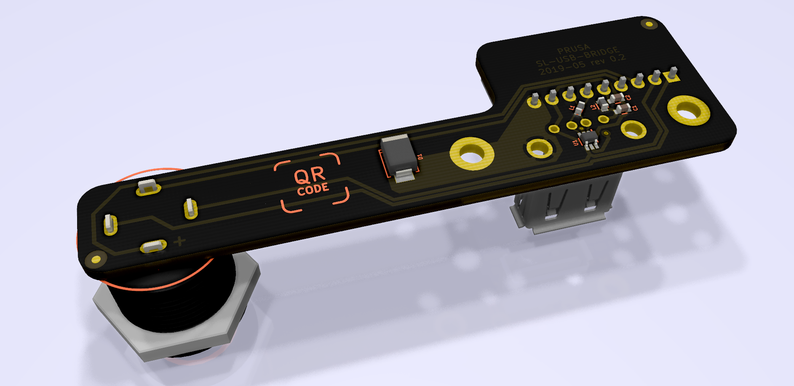

# PRUSA SL-USB board

KiCad PCB layout

* [Interactive bom](http://htmlpreview.github.io/?https://github.com/prusa3d/SL-USB-PCB/blob/master/rev.02/ibom.html)
* [STEP 3D model](rev.02/SL-USB-02.step)
